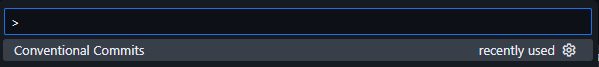
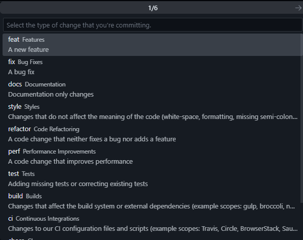

# Guide to setup conventional commits on commit

## What does conventional commits do?

docs: [conventionalcommits.org](https://www.conventionalcommits.org)<br>


Lightweight convention on top of commit messages. It provides an easy set of rules for creating an explicit commit history; which makes it easier to write automated tools on top of. This convention dovetails with SemVer, by describing the features, fixes, and breaking changes made in commit messages.

### Why Use Conventional Commits

- Automatically generating CHANGELOGs.
- Automatically determining a semantic version bump (based on the types of commits landed).
- Communicating the nature of changes to teammates, the public and other stakeholders.
- Triggering build and publish processes.
- Making it easier for people to contribute to your projects, by allowing them to explore a more structured commit history.

### Commit message structure

The commit message should be structured as follows:

```
<type>[optional scope]: [optional gitmoji] <description>

[optional body]

[optional footer(s)]
```

example:

```
feat(auth): ✨ <description>

[optional body]

[optional footer(s)]

```

## gitmoji

gitmoji: [gitmoji.dev](https://gitmoji.dev/)<br>


Gitmoji is an initiative to standardize and explain the use of emojis on GitHub commit messages.

Using emojis on commit messages provides an easy way of identifying the purpose or intention of a commit with only looking at the emojis used. As there are a lot of different emojis I found the need of creating a guide that can help to use emojis easier.

## Commit types and recommended emojis

| Commit Type | Title                    | Description                                                                                                 | Emoji |
| ----------- | ------------------------ | ----------------------------------------------------------------------------------------------------------- | :---: |
| `feat`      | Features                 | A new feature                                                                                               |  ✨   |
| `fix`       | Bug Fixes                | A bug Fix                                                                                                   |  🐛   |
| `docs`      | Documentation            | Documentation only changes                                                                                  |  📝   |
| `style`     | Styles                   | Changes that do not affect the meaning of the code (white-space, formatting, missing semi-colons, etc)      |  🎨   |
| `refactor`  | Code Refactoring         | A code change that neither fixes a bug nor adds a feature                                                   |  ♻️   |
| `perf`      | Performance Improvements | A code change that improves performance                                                                     |  ⚡   |
| `test`      | Tests                    | Adding missing tests or correcting existing tests                                                           |  ✅   |
| `build`     | Builds                   | Changes that affect the build system or external dependencies (example scopes: gulp, broccoli, npm)         |  📦️  |
| `ci`        | Continuous Integrations  | Changes to our CI configuration files and scripts (example scopes: Travis, Circle, BrowserStack, SauceLabs) |  👷   |
| `chore`     | Chores                   | Other changes that don't modify src or test files                                                           |  🔧   |
| `revert`    | Reverts                  | Reverts a previous commit                                                                                   |  ⏪️  |

### Other gitmojis

| Emoji | Use case                                               |
| ----- | ------------------------------------------------------ |
| 🎉    | Begin a project.                                       |
| 🚀    | Deploy stuff.                                          |
| 💄    | Add or update the UI and style files.                  |
| 🚑️   | Critical hotfix.                                       |
| 🚧    | Work in progress.                                      |
| 🔥    | Remove code or files.                                  |
| 🔇    | Remove logs.                                           |
| 🗑️    | Deprecate code that needs to be cleaned up.            |
| ⚰️    | Remove dead code.                                      |
| ➕    | Add dependency.                                        |
| ➖    | Remove dependency.                                     |
| 🚚    | Move or rename resources (e.g.: files, paths, routes). |
| 🍱    | Add or update assets.                                  |
| 💡    | Add or update comments in source code.                 |
| 💫    | Add or update animations and transitions.              |
| 🙈    | Add or update a .gitignore file.                       |

## Conventional commit examples

Good commits:

✅ _`chore: add shadcn package`_

✅ _`feat: ✨ add login button`_

✅ _`fix(auth): 🐛 token validation`_

✅ commit message with ! to draw attention to **breaking change**:

✅ _`feat!: send an email to the customer when a product is shipped`_

✅ _`feat(api)!: send an email to the customer when a product is shipped`_

✅ commit message with **description** and **breaking change footer** (BREAKING CHANGE)

```
feat: allow provided config object to extend other configs

BREAKING CHANGE: `extends` key in config file is now used for extending other config files
```

✅ message with **multi-paragraph body** and **multiple footers**

```
fix: prevent racing of requests

Introduce a request id and a reference to latest request. Dismiss
incoming responses other than from latest request.

Remove timeouts which were used to mitigate the racing issue but are
obsolete now.

Reviewed-by: Z
Refs: #123
```

Bad commits:

❌ _`Add LOgin BUTTON`_

❌ _`add login button`_

❌ _`commit message that is too large to fit in one commit, this means that the commit has too many changes to describe and you should split it into multiple commits or you require to use a multi-paragraph body and/or footers.`_

## ⭐ Recommendation: Install VSCode extension

vscode extension: [vivaxy.vscode-conventional-commits](https://marketplace.visualstudio.com/items?itemName=vivaxy.vscode-conventional-commits)<br>


### How to use

Once installed search for the _`Conventional Commits`_ command using:

- Windows: `ctrl`+ `shift` + `p`
- Mac: `command` + `shift` + `p`



This will open a menu to start creating your commit message selecting the options.



**Optional:** disable autoCommit

- The extension enables `conventionalCommits.autoCommit` by default, I recommend to disable it to only generate the formatted commit message.
- It can be disabled from the option in `Settings > conventionalCommits.autoCommit`.

## 🎉 Setup project in 3 steps

> Before starting, initialize a project if you dont have one with `npm init -y`.

### npm:

1. install dev dependencies.

```bash
npm i -D husky @commitlint/cli @commitlint/config-conventional
```

2. Create .husky folder with commit message hook.

```bash
npm pkg set scripts.prepare="husky"
npm run prepare
echo "npx --no -- commitlint --edit \$1" > .husky/commit-msg
```

3. Configure commitlint to use conventional config.

```bash
echo "export default { extends: ['@commitlint/config-conventional'] };" > commitlint.config.js
```

this will create **commitlint.config.js**:

```javascript
module.exports = {
  extends: ["@commitlint/config-conventional"],
};
```

### pnpm:

1. install dev dependencies.

```bash
pnpm add -D husky @commitlint/cli @commitlint/config-conventional
```

2. Create .husky folder with commit message hook.

```bash
pnpm pkg set scripts.prepare="husky"
pnpm run prepare
echo "pnpm dlx commitlint --edit \$1" > .husky/commit-msg
```

3. Configure commitlint to use conventional config.

```bash
echo "export default { extends: ['@commitlint/config-conventional'] };" > commitlint.config.js
```

this will create **commitlint.config.js**:

```javascript
module.exports = {
  extends: ["@commitlint/config-conventional"],
};
```

## FAQ

### How does this relate to SemVer?

1. `fix` type commits should be translated to `PATCH` releases.
2. `feat` type commits should be translated to `MINOR` releases.
3. Commits with `BREAKING CHANGE` in the commits, regardless of type, should be translated to `MAJOR` releases.

### Are the types in the commit title uppercase or lowercase?

Any casing may be used, but it’s best to be consistent.

### What do I do if the commit conforms to more than one of the commit types?

Go back and make multiple commits whenever possible. Part of the benefit of Conventional Commits is its ability to drive us to make more organized commits and PRs.

### Doesn’t this discourage rapid development and fast iteration?

It discourages moving fast in a disorganized way. It helps you be able to move fast long term across multiple projects with varied contributors.

### What do I do if I accidentally use the wrong commit type?

When you used a type that’s of the spec but not the correct type, e.g. `fix` instead of `feat`

**Prior to merging or releasing** the mistake, we recommend using `git rebase -i` to edit the commit history. After release, the cleanup will be different according to what tools and processes you use.
